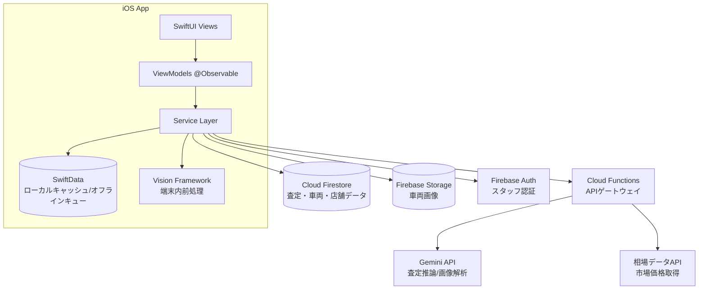

# 00_PROJECT_OVERVIEW.md — CarInspectorAI プロジェクト概要

| 項目 | 内容 |
|---|---|
| ドキュメントID | DOC-00 |
| バージョン | v1.0 |
| ステータス | 承認済み（実装開始可） |
| 関連 | 全ドキュメントの起点 |

---

## 1. システム概要

**CarInspectorAI** は、中古車販売店・買取店のスタッフが iPhone / iPad 1台で車両査定を完結できる、AI査定プラットフォーム（**AI中古車査定OS**）である。

スタッフが車両を規定アングルで撮影すると、AIが以下を自動で行う：

1. **写真品質判定** — ピント・明るさ・フレーミングを撮影直後に判定し、不備があれば再撮影を指示
2. **外装・内装ダメージ検出** — 傷・凹み・板金跡・タイヤ摩耗などを画像から検出
3. **修復歴推定** — 工具痕・色違い・パネル隙間・スポット溶接痕から修復歴の可能性を確率で提示
4. **査定価格算出** — 市場相場と車両状態を統合し、**加減点の根拠付き**で査定価格を提示
5. **査定漏れ診断** — 未確認項目（スペアキー・整備手帳・下回り等）をチェックリストで警告
6. **査定書PDF生成** — 顧客提示用の査定書を1タップで出力

さらに店舗単位で査定履歴・スタッフ・成約率をダッシュボードで管理できる。

### 1.1 「査定アプリ」ではなく「査定OS」である理由

従来の査定支援ツールは「価格を出す」単機能に留まる。本システムは査定業務の**全工程**——車両情報取得、撮影、AI解析、相場照合、価格算出、顧客説明、書類化、店舗管理——を1つのデータモデルの上に統合する。各機能はモジュールとして疎結合に設計し、将来の機能追加（OBD診断、オークション連携）を前提とする。

## 2. 開発目的

| # | 目的 | 現状の課題 |
|---|---|---|
| 1 | 査定の属人化解消 | ベテランと新人で査定額が数十万円ぶれる |
| 2 | 査定時間の短縮 | 1台30〜60分 → **10分以内**を目標 |
| 3 | 査定根拠の透明化 | 「なんとなくこの価格」では顧客が納得しない |
| 4 | 査定漏れ・見落とし防止 | 修復歴見落としは後の大きな損失・信用問題に直結 |
| 5 | 店舗経営の可視化 | 査定→成約のファネルがデータ化されていない |

## 3. コンセプト

> **「ベテラン査定士の目を、すべてのスタッフのポケットに。」**

- **説明できるAI**: 価格だけでなく「なぜその価格か」を必ず提示する（Explainable Appraisal）
- **その場で完結**: 撮影から査定書PDFまで、車両の前を離れずに完了する
- **人が最終決定**: AIは提案し、確定するのは人間。スタッフによる調整額と調整理由を必ず記録する

## 4. 対象ユーザー

| ペルソナ | 説明 | 主要ユースケース |
|---|---|---|
| 査定スタッフ（新人） | 入社1年未満。査定経験が浅い | ガイドに従って撮影→AI査定→先輩に確認依頼 |
| 査定スタッフ（ベテラン） | 経験10年以上 | AI査定を叩き台に価格調整、修復歴のダブルチェック |
| 店長 / マネージャー | 店舗の数値責任者 | ダッシュボードで査定件数・成約率・スタッフ別実績を確認 |
| 本部管理者（将来） | 複数店舗統括 | 店舗横断分析（Phase 3） |

- 利用環境: 屋外駐車場（直射日光・逆光・雨天）、屋内展示場、地下・電波の弱い場所
- **オフライン耐性は必須要件**（§10 非機能要件）

## 5. システム全体構成



**重要な設計判断**: Gemini API はアプリから直接呼ばず、**Cloud Functions をゲートウェイ**として経由する。理由：(1) APIキーを端末に置かない、(2) プロンプトをサーバー側で管理しアプリ更新なしに改善できる、(3) レートリミット・コスト制御・監査ログを一元化できる。

## 6. 技術スタック

| レイヤ | 技術 | バージョン/備考 |
|---|---|---|
| 言語 | Swift | 6.0 / Strict Concurrency |
| UI | SwiftUI | iOS 18+、Liquid Glass デザイン言語 |
| 状態管理 | Observation framework | `@Observable` |
| ローカルDB | SwiftData | キャッシュ + オフラインキュー |
| 端末内画像処理 | Vision Framework / Core Image | 品質前チェック、ナンバーマスキング |
| カメラ | AVFoundation | カスタムカメラUI |
| クラウドDB | Cloud Firestore | マルチテナント（店舗単位） |
| 画像ストレージ | Firebase Storage | |
| 認証 | Firebase Auth | メール+パスワード、将来SSO |
| サーバーレス | Cloud Functions (Node.js/TypeScript) | Gemini/相場APIゲートウェイ |
| AI推論 | Gemini API（マルチモーダル） | 構造化出力（JSON Schema準拠） |
| PDF | PDFKit + 独自レイアウトエンジン | 査定書生成 |
| CI | Xcode Cloud または GitHub Actions | `AGENTS.md` 参照 |

## 7. アーキテクチャ方針（サマリ）

詳細は `02_SYSTEM_ARCHITECTURE.md`。

1. **MVVM + Service層**、一方向依存
2. **Offline First**: 全書き込みはローカル(SwiftData)に先に保存 → バックグラウンドでFirestoreへ同期
3. **Schema Driven**: AI入出力は `schemas/` のJSON Schemaで契約化。Geminiには構造化出力を強制
4. **モジュール分割**: `Core` / `DesignSystem` / `AppraisalKit` / `CameraKit` / `SyncKit` のSwift Packageに分割
5. **AIは提案、人が確定**: AI出力はすべて `aiProposed` と `humanConfirmed` を分離して保存

## 8. ディレクトリ構成（実装リポジトリ）

```
CarInspectorAI-app/
├── CarInspectorAI/               # アプリターゲット
│   ├── App/                      # エントリポイント, AppContainer(DI), ルーティング
│   ├── Features/
│   │   ├── Home/                 # View + ViewModel
│   │   ├── Camera/
│   │   ├── VehicleInfo/
│   │   ├── AppraisalResult/
│   │   ├── History/
│   │   ├── Dashboard/
│   │   └── Settings/
│   └── Resources/                # Assets, Localizable.xcstrings
├── Packages/
│   ├── Core/                     # AppError, 共通モデル, ユーティリティ
│   ├── DesignSystem/             # デザイントークン, 共通コンポーネント
│   ├── AppraisalKit/             # 査定ドメイン: Service, DTO, スキーマ対応モデル
│   ├── CameraKit/                # AVFoundationラッパ, Vision前処理
│   └── SyncKit/                  # SwiftData⇔Firestore同期, オフラインキュー
├── functions/                    # Cloud Functions (TypeScript)
└── Tests/
```

## 9. 開発ルール

- `CLAUDE.md` / `AGENTS.md` を最上位ルールとする
- Docs First / Schema is Law / 1画面1PR
- 画面実装は必ず `SCREEN_*.md` を全文読了してから開始

## 10. 非機能要件（サマリ）

詳細は `01_REQUIREMENTS.md` §4。

| 項目 | 目標値 |
|---|---|
| 査定所要時間 | 撮影開始→査定価格表示まで **10分以内**（AI推論部は60秒以内） |
| オフライン | 撮影・入力・下書き保存は完全オフライン動作。同期は復帰後自動 |
| 写真品質判定 | 撮影後 **1.5秒以内** に判定表示（端末内Vision + 必要時のみクラウド） |
| クラッシュフリー率 | 99.8%以上 |
| 対応端末 | iPhone 13以降 / iPad (A14以降)、iOS 18+ |
| セキュリティ | 通信TLS1.3、保存時暗号化、ナンバー・顔の自動マスキング |
| 多店舗 | Firestoreマルチテナント。店舗間データ完全分離 |

## 11. AI利用方針

1. **構造化出力の強制**: Gemini には必ず JSON Schema（`schemas/`）を指定し、自由文の価格出力を禁止
2. **信頼度の必須化**: 全AI出力に `confidence`(0-1) を含める。閾値未満はUI上で「要確認」表示
3. **根拠の必須化**: 価格には必ず加減点内訳（`adjustments[]`）を付ける。内訳合計と価格の整合はクライアントで検証
4. **人間の最終確定**: AI出力のまま査定書を発行できない。スタッフ確認操作を必須とする
5. **学習データの扱い**: 顧客個人情報はAIへ送信しない。画像はマスキング後に送信（`07_SECURITY.md`）
6. **プロンプト管理**: プロンプトは `prompts/` で版管理し、Cloud Functions がデプロイ時に取り込む

## 12. 将来拡張（Phase 2以降）

| Phase | 機能 |
|---|---|
| Phase 2 | OBD-II診断連携（Bluetooth ELM327）、オークション出品票OCR比較、査定書テンプレートカスタマイズ |
| Phase 3 | 本部向け複数店舗分析、相場予測（時系列）、Android版検討 |
| 詳細 | `09_ROADMAP.md` |
