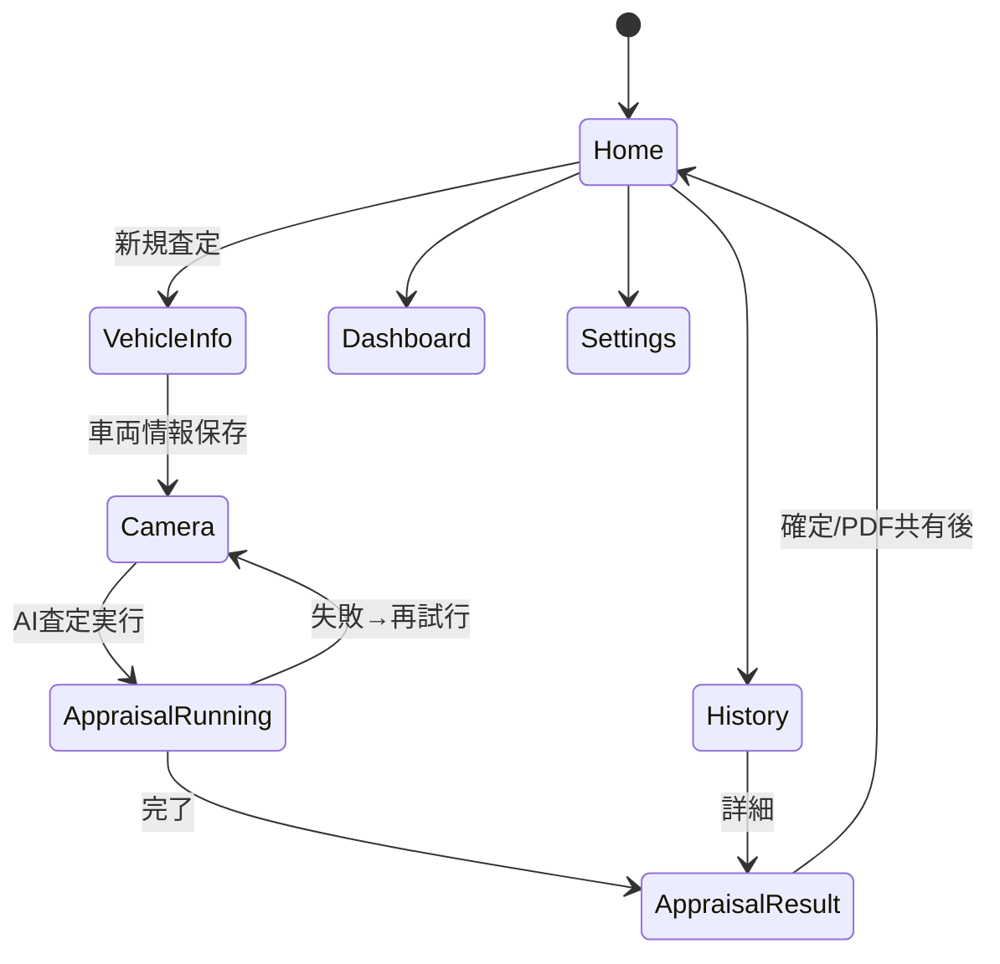

# 02_SYSTEM_ARCHITECTURE.md — システムアーキテクチャ

| 項目 | 内容 |
|---|---|
| ドキュメントID | DOC-02 |
| バージョン | v1.0 |
| 依存 | 00, 01, 04_DATA_MODEL.md, 05_AI_PIPELINE.md |

---

## 1. レイヤ構成と依存方向

```
┌──────────────────────────────────────────┐
│ View (SwiftUI)                            │  描画・操作の委譲のみ
├──────────────────────────────────────────┤
│ ViewModel (@Observable, @MainActor)       │  画面状態・ユースケース調停
├──────────────────────────────────────────┤
│ Service (protocol + Impl)                 │  業務ロジック・外部IO統合
├──────────────┬───────────────┬───────────┤
│ SwiftData    │ Firebase SDK  │ CameraKit │  インフラ
│ (SyncKit)    │ (SyncKit)     │ (Vision)  │
└──────────────┴───────────────┴───────────┘
```

- 依存は上→下のみ。下層は上層を知らない。
- ViewModel は Service を **protocol 型**で保持。`AppContainer` が Impl を注入。

## 2. モジュール（Swift Package）構成

| Package | 責務 | 依存 |
|---|---|---|
| `Core` | `AppError`, ドメインモデル, 共通拡張, ロガー | なし |
| `DesignSystem` | デザイントークン, 共通View部品（GlassCard, PrimaryButton等） | Core |
| `CameraKit` | AVFoundationセッション管理, 撮影, Vision品質前判定, マスキング | Core |
| `AppraisalKit` | 査定ドメイン: `AppraisalService`, DTO, schema対応Codable | Core |
| `SyncKit` | SwiftDataスタック, Firestore同期, オフラインキュー | Core, AppraisalKit |
| アプリ本体 | Features(View/ViewModel), App, ルーティング | 全部 |

## 3. DIコンテナ

```swift
@MainActor
final class AppContainer {
    let authService: AuthService
    let vehicleService: VehicleService
    let photoService: PhotoService
    let appraisalService: AppraisalService
    let syncService: SyncService
    let pdfService: PDFService
    let dashboardService: DashboardService

    static func production(modelContainer: ModelContainer) -> AppContainer { ... }
    static func mock() -> AppContainer { ... }  // Preview / Test用
}
```

- SwiftUI へは `.environment(\.container, container)` で伝搬。
- Preview は必ず `AppContainer.mock()` を使用（実ネットワーク禁止）。

## 4. 画面遷移（ルーティング）

`NavigationStack` + 型付きルート enum。

```swift
enum Route: Hashable {
    case vehicleInfo(draftId: UUID?)
    case camera(appraisalId: UUID)
    case appraisalRunning(appraisalId: UUID)
    case appraisalResult(appraisalId: UUID)
    case historyDetail(appraisalId: UUID)
    case dashboard
    case settings
}
```



## 5. Offline First 同期設計（SyncKit）

### 5.1 原則

1. **全ての書き込みはまず SwiftData** へ（`syncState = .pendingUpload`）。
2. `SyncService` がバックグラウンドで Firestore へ反映。成功で `.synced`。
3. 読み取りは SwiftData キャッシュ優先 + Firestore スナップショットリスナーで更新。

### 5.2 同期状態

```swift
enum SyncState: String, Codable {
    case localOnly       // 下書き。まだ同期対象外
    case pendingUpload   // アップロード待ち（オフラインキュー）
    case uploading
    case synced
    case conflict        // サーバーと競合。サーバー版採用+ローカルを退避コピー
    case failed          // リトライ上限到達。手動再送UI（FR-702）
}
```

### 5.3 オフラインキュー

- キュー実体は SwiftData の `SyncTask`（順序保証: createdAt昇順、同一appraisalIdは直列）。
- リトライ: 指数バックオフ（2s→8s→30s、最大3回/セッション）。
- 画像は Firestore ドキュメント同期と分離し、Storage への resumable upload。ドキュメントには `photoUploadState` を持つ。
- AI査定リクエストもキュー対象（UC-02）。実行はドキュメント+画像の同期完了が前提条件。

## 6. エラー設計

```swift
enum AppError: Error, LocalizedError {
    // ネットワーク
    case offline
    case timeout(operation: String)
    case serverError(code: Int)
    // AI
    case aiInvalidResponse(reason: String)   // schema不適合・内訳不整合(BR-02)
    case aiLowConfidence(score: Double)
    case aiQuotaExceeded
    // カメラ/権限
    case cameraPermissionDenied
    case photoQualityCheckFailed
    // データ
    case notFound(entity: String)
    case conflict
    case storageFull
    // 認証
    case unauthenticated
    case forbidden
}
```

- Service は必ず `AppError` に変換して throw。SDK生エラーを上層に漏らさない。
- ViewModel は `AppError` → 表示文言（xcstrings）+ 回復アクション（再試行/設定を開く/後で）にマップ。

## 7. 並行性・スレッド方針

- ViewModel は `@MainActor`。
- Service は actor もしくは Sendable な struct。重い画像処理は `CameraKit` 内の専用 actor で実行。
- Swift 6 Strict Concurrency = Complete を維持（ビルド警告ゼロ）。

## 8. Cloud Functions（APIゲートウェイ）

| Function | 役割 |
|---|---|
| `runAppraisal` | 画像URL+車両情報を受け、prompts/schemas を適用して Gemini 呼び出し → 検証 → `appraisals/{id}.aiResult` に書き込み |
| `checkPhotoQuality` | クラウド品質判定（端末内判定で不十分な高度ケース） |
| `fetchMarketPrice` | 相場データAPIプロキシ + 24hキャッシュ |
| `generateAuctionComparison` | Phase 2: 出品票OCR比較 |

- 呼び出しは Firebase Auth トークン必須。App Check 有効化。
- `runAppraisal` は冪等（同一 `requestId` の重複実行を防止）。
- **クライアントは結果を関数レスポンスではなく Firestore リスナーで受け取る**（長時間処理+オフライン耐性のため）。

## 9. 監視・ロギング

- Crashlytics（クラッシュ）、Performance Monitoring（起動・画面表示・AI所要時間）
- 構造化ログ: `Logger(subsystem: "com.animetourism.carinspector", category: ...)`
- AI呼び出しは Functions 側で全件監査ログ（requestId, storeId, トークン数, レイテンシ, 結果検証OK/NG）
