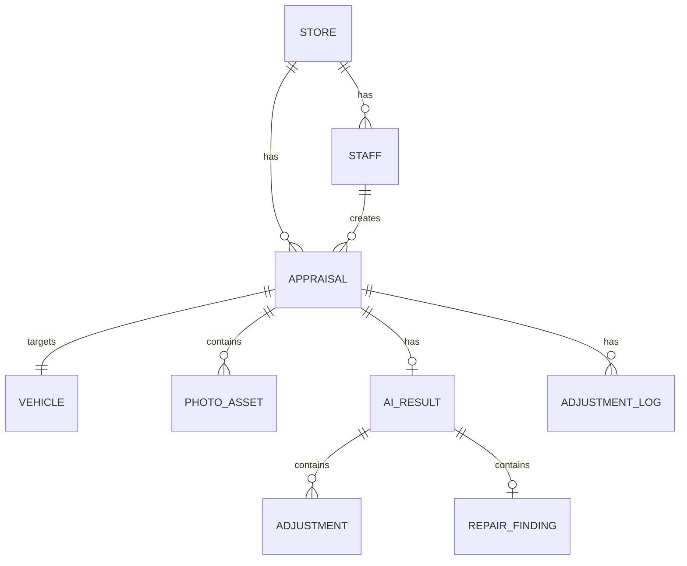

# 04_DATA_MODEL.md — データモデル設計

| 項目 | 内容 |
|---|---|
| ドキュメントID | DOC-04 |
| バージョン | v1.0 |
| 依存 | 02, schemas/firestore_collections.md |

SwiftData（ローカル）と Firestore（クラウド）は**同型のドメインモデル**を共有し、DTO変換で往復する。IDは全て UUID 文字列でクライアント生成（オフライン作成を可能にするため）。

---

## 1. ER概要



## 2. SwiftData モデル

### 2.1 Vehicle

```swift
@Model
final class Vehicle {
    @Attribute(.unique) var id: String            // UUID
    var vin: String?                              // 車台番号
    var makerCode: String                         // メーカー
    var modelCode: String                         // 車種
    var gradeCode: String?                        // グレード
    var modelYear: Int?                           // 年式（初度登録年）
    var firstRegistrationYM: String?              // "2021-03"
    var mileageKm: Int
    var colorCode: String
    var inspectionExpiry: Date?                   // 車検満了
    var equipments: [String]                      // 装備コード配列
    var createdAt: Date
    var updatedAt: Date
}
```

### 2.2 Appraisal（中核エンティティ）

```swift
@Model
final class Appraisal {
    @Attribute(.unique) var id: String
    var storeId: String
    var staffId: String
    var status: AppraisalStatus                   // draft/aiCompleted/confirmed/won/lost/expired
    @Relationship(deleteRule: .cascade) var vehicle: Vehicle
    @Relationship(deleteRule: .cascade) var photos: [PhotoAsset]
    var aiResultJSON: Data?                       // schemas/appraisal_result準拠の生JSON（監査用に原本保持）
    var aiConfidence: Double?                     // 0-1
    var aiProposedPrice: Int?                     // AI提案額（円）
    var confirmedPrice: Int?                      // 人間確定額
    var adjustmentReason: String?                 // 調整理由（FR-407）
    var repairProbability: Double?
    var repairConfirmedState: RepairConfirmedState? // none/confirmedYes/confirmedNo/unknown
    var completenessScore: Double?                // 査定品質 0-1
    var uncheckedItems: [String]                  // 未確認項目コード
    var marketAveragePrice: Int?
    var syncState: SyncState
    var expiresAt: Date?                          // 確定時 +7日（BR-05）
    var createdAt: Date
    var updatedAt: Date
}

enum AppraisalStatus: String, Codable {
    case draft, aiRunning, aiCompleted, confirmed, won, lost, expired
}
```

### 2.3 PhotoAsset

```swift
@Model
final class PhotoAsset {
    @Attribute(.unique) var id: String
    var appraisalId: String
    var angle: PhotoAngle                         // 規定12アングル or .damage(自由撮影)
    var damageTag: String?                        // 部位タグ（angle == .damage時）
    var localOriginalPath: String                 // 原本（端末のみ・マスキング前）
    var localMaskedPath: String?                  // マスキング済（アップロード対象）
    var remoteURL: String?                        // Storage URL
    var qualityResultJSON: Data?                  // schemas/photo_quality 準拠
    var qualityPassed: Bool
    var uploadState: UploadState                  // pending/uploading/done/failed
    var takenAt: Date
}

enum PhotoAngle: String, Codable, CaseIterable {
    case front, rear, left, right
    case frontLeft, frontRight, rearLeft, rearRight
    case interiorFront, interiorRear
    case meter, engineRoom
    case damage                                   // 自由撮影
}
```

### 2.4 SyncTask（オフラインキュー）

```swift
@Model
final class SyncTask {
    @Attribute(.unique) var id: String
    var kind: SyncTaskKind        // uploadAppraisal/uploadPhoto/requestAIAppraisal
    var targetId: String          // appraisalId or photoId
    var retryCount: Int
    var lastError: String?
    var state: SyncState
    var createdAt: Date
}
```

## 3. Firestore コレクション（要約）

完全定義は `schemas/firestore_collections.md`。

```
stores/{storeId}
  ├── name, logoURL, address, settings
  ├── staffs/{staffId}: role, displayName, email, active
  ├── appraisals/{appraisalId}: AppraisalDTO（vehicle埋め込み, photos配列はメタのみ）
  │     └── adjustmentLogs/{logId}: before, after, reason, staffId, at   // BR-06
  └── masters は別トップレベル（下記）

masters/vehicles/{makerCode}/models/{modelCode}: グレード・型式マスタ（読み取り専用配信）
masters/equipments/{code}
masters/checkItems/{code}                         // 査定漏れ診断の項目マスタ
```

### 3.1 マルチテナント境界

- 全業務データは `stores/{storeId}` 配下。Security Rules で `request.auth.token.storeId == storeId` を強制（FR-102, 07_SECURITY.md）。
- `masters/*` は認証済み全ユーザー read のみ。

### 3.2 AppraisalDTO ⇔ SwiftData 変換規約

- フィールド名は同名。日付は Firestore Timestamp ⇔ Date。
- `aiResultJSON` は Firestore では `aiResult`（map）として展開保存（クエリ可能にするため）。クライアント受信時に再エンコードして原本フィールドへ。
- 変換は `SyncKit` の `AppraisalMapper` に集約。**変換ロジックを他所に書かない**。

## 4. インデックス設計（Firestore）

| クエリ | 複合インデックス |
|---|---|
| 履歴一覧（FR-601） | `storeId` + `status` + `createdAt desc` |
| スタッフ別実績（FR-603） | `storeId` + `staffId` + `createdAt desc` |
| 期限切れ検出（BR-05） | `storeId` + `status==confirmed` + `expiresAt asc` |

## 5. データ保持・削除

- 端末: 原本画像は確定後90日で自動削除（設定で変更可）。マスキング済はRemote同期後削除可。
- クラウド: 査定データは法定・商習慣を踏まえ7年保持（storeの設定で変更可能に設計）。
- 論理削除（`deletedAt`）を採用。物理削除はバッチのみ。
