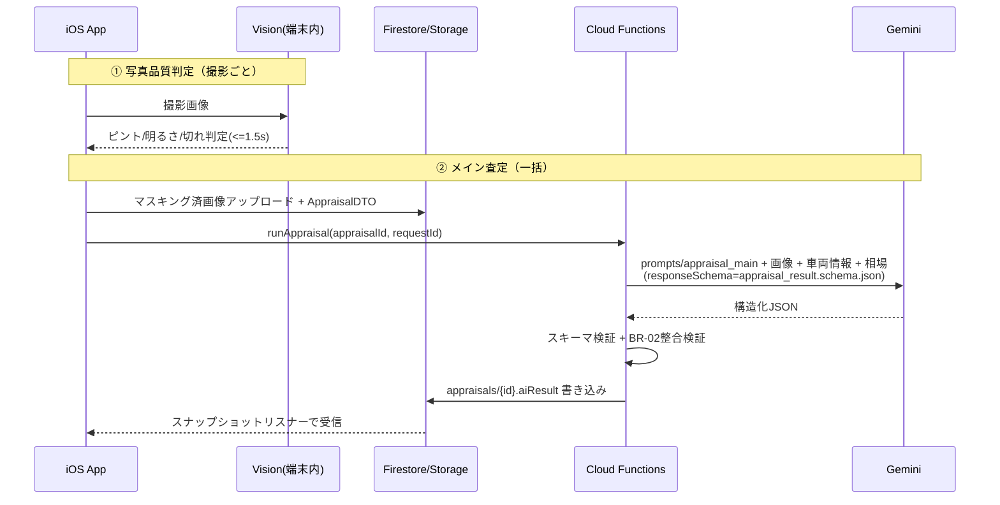

# 05_AI_PIPELINE.md — AI査定パイプライン設計

| 項目 | 内容 |
|---|---|
| ドキュメントID | DOC-05 |
| バージョン | v1.0 |
| 依存 | 02, 04, prompts/*, schemas/*, examples/* |

本ドキュメントはAI機能5本柱の処理フロー・入出力契約・検証・失敗時挙動を定義する。
**プロンプト本文は `prompts/`、入出力スキーマは `schemas/` が正**であり、本書はそれらの結線図である。

---

## 1. パイプライン全体像



## 2. ① 写真品質AI（FR-302/303）

### 2.1 二段構え

| 段 | 実行場所 | 判定項目 | 所要 |
|---|---|---|---|
| 一次 | 端末内 Vision/CoreImage | ピント（ラプラシアン分散）、明るさ（輝度ヒストグラム）、車両検出+バウンディングボックスでの見切れ判定 | <=1.5s |
| 二次 | Cloud Functions `checkPhotoQuality`（任意） | アングル適合（「これは右前45°か」）、反射・雨滴、汚れによる判定不能 | 非同期・撮影は止めない |

- 一次でNGなら即 `QualityToast` で再撮影指示（撮影フローをブロック）。
- 二次NGは撮影一覧画面にバッジ表示（後から差し替え可能）。
- 出力契約: `schemas/photo_quality.schema.json` / 例: `examples/photo_quality.example.json`

### 2.2 判定基準（一次）

| 項目 | OK基準 | NG時メッセージ例 |
|---|---|---|
| ピント | ラプラシアン分散 >= 閾値（端末別チューニング値はCameraKit定数） | 「ピントが合っていません。もう一度撮影してください」 |
| 明るさ | 輝度中央値 40〜215 | 「暗すぎます。明るい場所で撮影してください」 |
| 見切れ | 車両BBoxが規定アングルの必須領域を包含 | 「ボンネットが切れています。少し下がって撮影してください」 |
| 傾き | 水平±7°以内 | 「端末を水平にして撮影してください」 |

## 3. ② メイン査定（FR-401〜404）

### 3.1 入力（GeminiAppraisalRequest → prompts/appraisal_main.md に展開）

- 車両情報（Vehicle全項目）+ 装備
- 画像: マスキング済12アングル + damage写真（部位タグ付き）
- 相場データ: `fetchMarketPrice` の結果（同条件帯の平均・分布・直近トレンド）
- 店舗ポリシー: 利益率設定等（storeの settings）

### 3.2 出力契約（appraisal_result.schema.json 要点）

```
appraisedPrice: int          // 円。1万円単位（BR-01はCF側で丸め検証）
basePrice: int               // 相場基準価格
adjustments[]: {code, label, amount(+/-円), evidencePhotoIds[], rationale}
marketAveragePrice: int
confidence: 0-1
repairFinding: {probability: 0-1, evidences[]: {type, photoId, region, note}}
completeness: {score: 0-1, uncheckedItems[]: code}
```

### 3.3 検証（Cloud Functions 内、順に実施）

1. JSON Schema 適合（ajv）
2. **BR-02**: `basePrice + Σadjustments.amount == appraisedPrice`（不一致→1回だけ自己修正リトライ→なお不一致なら `aiInvalidResponse`）
3. `evidencePhotoIds` が実在する photoId を指すこと
4. 価格レンジ妥当性: 相場平均の 0.3〜1.7倍 の外なら `needsReview` フラグ
5. 検証通過後にのみ Firestore 書き込み

### 3.4 タイムアウト・リトライ

- Gemini呼び出しタイムアウト 45s。CF全体で55s。クライアント側 NFR-02 の60sと整合。
- 失敗時: CFが `aiStatus = failed(reason)` を書き込み → アプリは再試行ボタン表示。requestId 冪等。

## 4. ③ 修復歴推定（FR-405）

- メイン査定と同一リクエスト内で実施（`repairFinding`）。追加ラウンドトリップなし。
- 根拠タイプ: `toolMarks`（工具痕）/ `colorMismatch`（色差）/ `panelGap`（隙間不整）/ `weldSpots`(スポット溶接) / `sealant`（シーラント不自然）
- `probability >= 0.5` で結果画面に警告カード + 該当画像に注釈矩形（`region` 座標を描画）。
- スタッフ確認（UC-03）→ 「あり」確定時は CF `runAppraisal` を `repairConfirmed: true` で再実行（BR-04）。

## 5. ④ 査定漏れ診断（FR-406）

- チェック項目マスタ: `masters/checkItems`（スペアキー/整備手帳/下回り/エンジン始動/エアコン/ナビ動作/タイヤ4本/ジャッキ工具…）
- AIは画像・入力から**確認済みと推定できる項目**を消し込み、残りを `uncheckedItems` として返す。
- `completeness.score` = 確認済/全項目（重み付き）。結果画面でチェックリスト化し、スタッフの手動チェックで更新。
- スコアはあくまで業務支援。確定のブロック条件は BR-03（信頼度）と修復歴確認のみ。

## 6. ⑤ オークション出品票比較（FR-409, Phase 2）

- 出品票撮影 → CF `generateAuctionComparison` → OCR（Gemini vision）→ 評価点・部位記号（A2/U3等）を構造化 → 今回査定の検出ダメージと部位単位で突合。
- 出力: `schemas/auction_comparison.schema.json`。「右フェンダー: 出品票A2 → 今回A3（傷が増えています）」形式の差分リスト。
- v1では設計のみ（スキーマとプロンプトの雛形を先行定義済み）。

## 7. コスト・レート制御（NFR-12）

- 画像は長辺2048px/JPEG80%に統一（FR-306）→ 1査定あたり最大16枚。
- CF側で store 単位のレート制限（例: 10査定/分）と日次上限。超過は `aiQuotaExceeded`。
- プロンプトは max output tokens を schema想定サイズ+マージンで固定。

## 8. プロンプト運用

- `prompts/*.md` はフロントマター（version, model, temperature, maxOutputTokens）+ 本文。
- CFデプロイ時にバンドル。バージョンは監査ログに記録し、A/B切替は store settings のフラグで行う。
- プロンプト変更のみのリリースはアプリ審査不要（サーバー側完結）。
