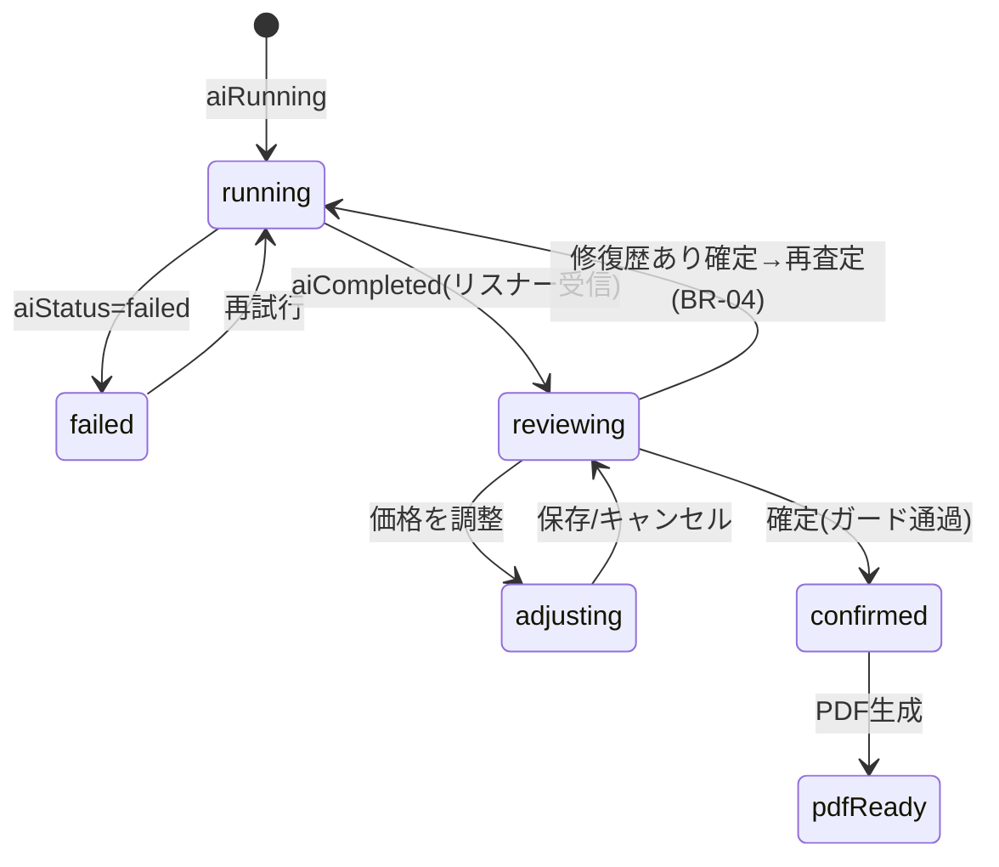

# SCREEN_APPRAISAL_RESULT.md — 査定結果画面

| 項目 | 内容 |
|---|---|
| ドキュメントID | SCR-RESULT |
| バージョン | v1.0 |
| 要件 | FR-401〜407, FR-501〜504, BR-01〜06, UC-03 |
| 依存 | 03, 04, 05, schemas/appraisal_result.schema.json |

---

## 1. 画面目的

AI査定の**価格と根拠**を1画面で顧客に見せられる品質で提示し、スタッフの確認・調整・確定までを完了させる。「AI解析中」画面（Running）も本仕様に含む。

## 2. UI構成

### 2.1 Running（解析中）ビュー

- 中央: 車両サムネイル + 不確定プログレスリング
- 段階メッセージ（3秒毎切替）: 「画像を解析しています…」→「市場相場を照合しています…」→「査定価格を計算しています…」/ 30秒超: 「混み合っています。もう少しお待ちください」（NFR-02）
- 失敗時: 理由文言 + `PrimaryButton「再試行」` / `SecondaryButton「後で実行」`（キュー退避）

### 2.2 結果ビュー（上から順）

```
① 価格カード(glassStrong)
   査定価格 ¥1,830,000（PriceLabel カウントアップ）
   下取参考 ¥1,9xx,xxx ／ ConfidenceBadge 94%
   [needsReviewフラグ時: ⚠️ 相場乖離が大きいため要確認]
② 根拠カード「査定の内訳」
   基準価格(市場相場)  ¥1,810,000
   + 人気カラー        +¥50,000   (根拠photo→タップで画像)
   + 禁煙車            +¥30,000
   − 左前ドア板金      −¥40,000
   − タイヤ摩耗        −¥20,000
   − 市場相場下落      −¥10,000
   ＝ 査定価格         ¥1,830,000
③ 市場比較カード: 市場平均¥1,810,000 / 乖離 +1.1% / 30日トレンド▼ / 分布バー(p25-p75と自車位置)
④ 修復歴カード（probability>=0.5時は danger 枠で最上部②の上に昇格）
   修復歴の可能性 78%
   根拠: 右フロント 工具痕 / 右フェンダー 色差 …（各→注釈付き画像ビューア）
   [現車確認: あり / なし / 不明]  ← 未選択なら確定ボタン無効(UC-03)
⑤ 査定品質カード: スコア98% + 未確認チェックリスト(□スペアキー □整備手帳 □下回り…)
   チェックONで即時再計算(ローカル)・同期
⑥ 操作エリア(下部固定 glass)
   [価格を調整] [査定を確定]  → 確定後: [PDFを作成] [共有]
```

- 価格調整シート: ステッパー(1万円単位, BR-01) + 理由必須テキスト（FR-407）。AI提案額との差分を常時表示。
- 確定ガード: confidence<60% は staff 不可（BR-03、manager承認シートへ）。修復歴未確認は不可（UC-03）。

## 3. 状態遷移



## 4. ViewModel 責務（AppraisalResultViewModel）

```swift
@MainActor @Observable
final class AppraisalResultViewModel {
    var appraisal: Appraisal?
    var phase: ResultPhase                    // running/failed/reviewing/confirmed
    var progressMessageIndex: Int
    var isAdjustSheetPresented: Bool
    var adjustedPrice: Int?
    var adjustmentReason: String
    var canConfirm: Bool                      // ガード計算(BR-03, UC-03, 理由必須)
    var error: AppError?

    private let appraisalService: AppraisalService
    private let pdfService: PDFService

    func observe(appraisalId: String) async   // observeAppraisal のstream購読
    func retryAI() async
    func setRepairConfirmed(_ s: RepairConfirmedState) async  // 「あり」→再査定発火
    func toggleCheckItem(_ code: String) async
    func confirm() async                      // BR-06ログはService側
    func generatePDF() async -> URL?
}
```

## 5. Service 責務

- 結果受信は `observeAppraisal`（Firestoreリスナー→SwiftData反映→stream）。**画面がCFを直接ポーリングしない**。
- 検証済み `aiResultJSON` のデコードは AppraisalKit の `AppraisalResult` Codable（schema準拠）。デコード失敗は aiInvalidResponse として再試行導線。
- confirm 時: BR-03/理由必須をService側でも検証（クライアント表示は補助）。

## 6. Firestore 更新

| 操作 | 更新 |
|---|---|
| チェック項目ON/OFF | `appraisals/{id}.checkedItems`（オフライン時はキュー） |
| 修復歴確認 | `repairConfirmedState` + 「あり」時 CF再実行 |
| 価格確定 | `confirmedPrice, adjustmentReason, status=confirmed, expiresAt=+7d` + `adjustmentLogs` 追記 |
| PDF生成 | 監査ログ追記（07 §5） |

## 7. SwiftData キャッシュ

- 受信した aiResult は即キャッシュ。**オフラインでも結果閲覧・チェック操作・PDF生成可能**（同期は復帰後）。
- 注釈付き画像はローカルマスク済パス優先、なければ remoteURL。

## 8. Geminiへ送るJSON

- この画面から新規送信はない（再査定は `runAppraisal(repairConfirmed:)` の再発火のみ）。
- 表示は `schemas/appraisal_result.schema.json` / `examples/appraisal_result.example.json` を唯一の形とする。

## 9. Vision Framework 処理

- 修復歴 `evidences[].region`（正規化座標）を画像上に矩形+ラベル描画（描画のみ、Vision推論はなし）。

## 10. エラーハンドリング

| ケース | 挙動 |
|---|---|
| aiInvalidResponse | 「解析結果に問題がありました」+再試行（requestId更新） |
| aiQuotaExceeded | 「本日の解析上限に達しました」+managerへの案内 |
| 確定時オフライン | ローカル確定→キュー同期、UIは確定済み表示+OfflineBanner |
| PDF生成失敗 | 再試行。appraisalデータは影響なし |

## 11. アニメーション

- 価格カウントアップ（03 §3）、内訳行は上から60ms間隔でフェードイン
- 修復歴カード出現時 haptic .warning（1回のみ）
- チェックON時にスコアがカウント変化

## 12. Liquid Glass デザインルール

- 価格カードのみ `ci.glassStrong`（可読性最優先）。他カードは `ci.glass`
- 加点=accent/+、減点=danger/−。needsReview/低confidenceは warning 枠線

## 13. アクセシビリティ

- 価格・内訳の読み上げ形式は 03 §5 準拠
- 分布バーは「市場の中央より上位25%の位置」とテキスト代替
- 確定ボタン無効時、無効理由をaccessibilityHintで提示

## 14. テストケース

| ID | ケース | 期待 |
|---|---|---|
| SCR-RES-01 | aiCompleted受信 | reviewing表示、内訳合計=価格 |
| SCR-RES-02 | confidence 94% | accentバッジ、確定可 |
| SCR-RES-03 | confidence 59% + staff | 確定→manager承認シート |
| SCR-RES-04 | 修復歴78%・未確認 | 確定ボタン無効+理由Hint |
| SCR-RES-05 | 「あり」選択 | running へ戻り再査定、完了後価格更新 |
| SCR-RES-06 | 調整+理由空 | 保存不可 |
| SCR-RES-07 | オフラインで確定 | ローカル確定+キュー、復帰後synced |

## 15. Claude Code 実装指示

1. `AppraisalResult` Codable と Validator（BR-02クライアント検証含む）を先に実装し、examples でUT green。
2. Running/結果 は同一Viewの phase 分岐（別画面にしない。リスナー継続のため）。
3. カード群は DesignSystem の `GlassCard`/`AdjustmentRow`/`ConfidenceBadge` を使用。新規共通部品が必要なら DesignSystem へ追加提案。
4. 注釈画像ビューアは `EvidencePhotoViewer` として Feature 内実装（ズーム+矩形描画）。
5. 確定ガードのロジックは ViewModel の computed 1箇所（`canConfirm`）に集約し、テストはそこを叩く。
