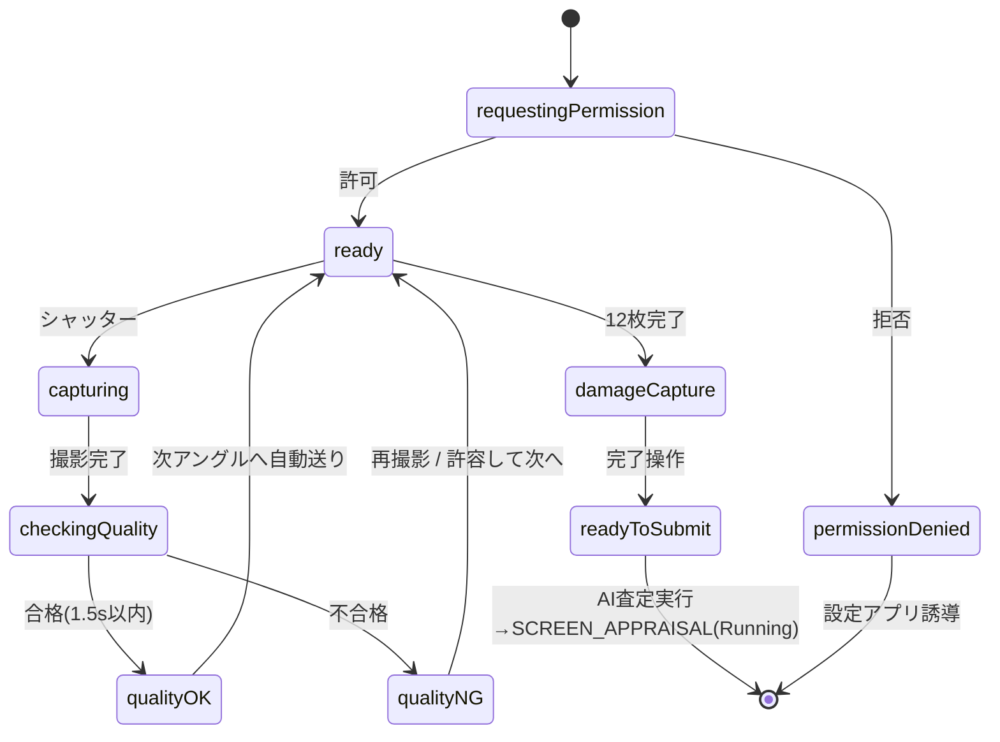

# SCREEN_CAMERA.md — 撮影画面

| 項目 | 内容 |
|---|---|
| ドキュメントID | SCR-CAMERA |
| バージョン | v1.0 |
| 要件 | FR-301〜306, NFR-01 |
| 依存 | 03(トークン), 04(PhotoAsset), 05 §2(品質AI), 07 §2(マスキング) |

---

## 1. 画面目的

規定12アングル+ダメージ自由撮影を、**新人でも迷わず・撮り直し最小で**完了させる。撮影直後の品質AI判定で「使えない写真」を現場で潰す。

## 2. UI構成

```
┌─────────────────────────────┐
│ [✕閉じる]   3/12  右前45°    │ ← 上部バー(glass)：進捗・アングル名
│                             │
│      ┌─  ガイド枠  ─┐       │ ← アングル別シルエットオーバーレイ
│      │   (車両輪郭)   │      │    (SVG→Shape、透過白 60%)
│      └───────────────┘      │
│  ⚠︎ 水平にしてください        │ ← 水平インジケータ(±7°超で表示)
│                             │
│ [サムネイル帯 ○○●○…]        │ ← 撮影済/未撮影/現在。タップでジャンプ
│      [⚡] ( SHUTTER ) [⟳]   │ ← 下部操作(glass)：ライト/シャッター72pt/前面背面
└─────────────────────────────┘
撮影直後: QualityToast
  ✓ ピント ✓ 明るさ ✕ ボンネットが切れています
  「少し下がって撮影してください」 [再撮影] [このまま使う※]
```

- ※「このまま使う」は framing NG のみ許可（focus/brightness NG は再撮影必須）。使用時 `qualityPassed=false` を記録。
- 12アングル完了後「ダメージ撮影」セクション: 自由撮影 → 部位タグシート（前バンパー/右前ドア…のグリッド選択）→ 任意メモ。
- 全完了で右下に `PrimaryButton「AI査定を実行 (14枚)」`。

## 3. 状態遷移



## 4. ViewModel 責務（CameraViewModel）

```swift
@MainActor @Observable
final class CameraViewModel {
    // 状態
    var phase: CameraPhase                 // §3のstate
    var currentAngle: PhotoAngle
    var capturedPhotos: [PhotoAngle: PhotoAsset]
    var damagePhotos: [PhotoAsset]
    var qualityToast: PhotoQualityResult?
    var levelAngle: Double                 // 水平計
    var isTorchOn: Bool
    var error: AppError?

    // 依存（protocol注入）
    private let photoService: PhotoService
    private let appraisalService: AppraisalService

    // 操作
    func onAppear() async                  // 権限→セッション開始
    func capture() async                   // 撮影→品質判定→保存 の調停
    func retake()
    func acceptDespiteWarning()            // framing NGのみ
    func jumpTo(angle: PhotoAngle)
    func addDamagePhoto() async
    func setDamageTag(_ tag: String, memo: String?)
    func submitForAppraisal() async        // appraisalService.requestAIAppraisal
}
```

- 責務: フロー制御・状態保持のみ。**画像処理・AVFoundation操作は一切持たない**（PhotoService/CameraKitへ委譲）。
- `capture()` 内シーケンス: `photoService.capture` → `checkQuality`（並行で `mask` 開始）→ 合格なら `persist` → 次アングル。

## 5. Service 責務

- `PhotoService`（06 §1.3）: 撮影、一次品質判定（Vision）、マスキング、PhotoAsset保存。
- `CameraKit` 内部: AVCaptureSession管理（actor）、輝度/ラプラシアン計算、車両BBox検出、ガイド枠との包含判定、水平計（CoreMotion）。
- 品質判定基準・閾値は 05 §2.2 が正。メッセージ文言は xcstrings キー `camera.quality.*`。

## 6. Firestore 更新

- この画面では**ドキュメント書き込みを行わない**（すべてSwiftData: PhotoAsset + Appraisal.photos 更新、syncState=localOnly）。
- `submitForAppraisal` 時に: Appraisal を pendingUpload 化 → SyncKit が (1)ドキュメント (2)マスク済画像Storage (3)CF runAppraisal を順に実行（05 §1）。

## 7. SwiftData キャッシュ

- 原本: `localOriginalPath`（Application Support/photos/original/、Data Protection有効）
- マスク済: `localMaskedPath`。アップロード完了(`uploadState=done`)後も査定確定までは保持
- 中断復帰: appraisalId で PhotoAsset を引き、撮影済アングルを復元（下書き自動保存 FR-205）

## 8. Geminiへ送るJSON（この画面起点の情報）

`schemas/appraisal_request.schema.json` の `photos[]` 要素を構成:

```json
{ "photoId": "…", "angle": "frontRight", "damageTag": null, "memo": null, "storagePath": "stores/…/photos/…" }
```

- damage写真は `"angle": "damage", "damageTag": "rightFrontDoor", "memo": "深い線傷"`。
- 画像本体はCFがStorageから取得（クライアントはパスのみ送る）。

## 9. Vision Framework 処理

| 処理 | API | 備考 |
|---|---|---|
| 車両検出 | VNRecognizeObjectsRequest（車両クラス） | BBoxでガイド枠包含判定 |
| ピント | CIラプラシアンフィルタ→分散 | 閾値はCameraKit定数、端末別テーブル |
| 明るさ | CIAreaHistogram → 輝度中央値 | 40〜215 |
| ナンバー検出 | VNDetectRectanglesRequest + テキスト検出の複合 | 07 §2.2 マスキング入力 |
| 顔検出 | VNDetectFaceRectanglesRequest | 同上 |

- 全てバックグラウンドactor実行。UIブロック禁止。1.5s SLA計測は signpost 埋め込み（08 §6）。

## 10. エラーハンドリング

| エラー | UI挙動 |
|---|---|
| cameraPermissionDenied | 全画面説明+「設定を開く」 |
| 品質判定タイムアウト(>1.5s) | 判定スキップし警告バッジ付きで続行（撮影を止めない） |
| storageFull | 撮影ブロック+容量案内（FR-703導線） |
| マスキング失敗 | maskVerified=false、レビュー画面で手動マスク誘導（07 §2.2） |
| submit時オフライン | 「通信回復後に自動実行します」→ホームへ（UC-02） |

## 11. アニメーション

- QualityToast: 03 §3 準拠（spring、OK自動消滅1.2s）
- アングル自動送り: ガイド枠クロスフェード0.25s + サムネイル帯のスクロール
- シャッター: 画面フラッシュ(白 0.1s) + haptic .rigid
- 水平インジケータ: ±7°跨ぎでフェード

## 12. Liquid Glass デザインルール

- 上部バー/下部操作/トーストは `ci.glass`。ファインダー映像上のため文字は白+シャドウでコントラスト確保
- ガイド枠シルエットは60%白。合格範囲に入ると `ci.accent` にトランジション
- トースト内の ✓=accent / ✕=danger、記号併記（色覚対応）

## 13. アクセシビリティ

- VoiceOver: シャッター「撮影。現在 右前45度、3枚目、全12枚」/ トーストは即時読み上げ（.announcement）
- ガイド適合を音でも通知（適合時に短いポジティブ音、設定でOFF可）
- Dynamic Type: トースト文言2行まで想定、超過はスクロール
- 片手: シャッター・主要操作は下部1/3に集約（03 §1）

## 14. テストケース（この画面固有）

08_TEST_PLAN の UT-PQ/UT-MASK/UI-04 に加え:

| ID | ケース | 期待 |
|---|---|---|
| SCR-CAM-01 | 12枚目合格 | ダメージ撮影セクションへ自動遷移 |
| SCR-CAM-02 | アプリ強制終了→再開 | 撮影済3枚が復元され4枚目から再開 |
| SCR-CAM-03 | framing NGで「このまま使う」 | qualityPassed=false 記録、次へ進む |
| SCR-CAM-04 | focus NG | 「このまま使う」ボタンが表示されない |
| SCR-CAM-05 | 撮影中に着信/バックグラウンド | セッション復帰、データ欠損なし |

## 15. Claude Code 実装指示

1. `CameraKit` の actor（セッション・Vision）→ `PhotoService` → `CameraViewModel` → `CameraView` の順で実装。
2. Vision閾値は `CameraKitConstants.swift` に集約し、フィクスチャ画像でUT-PQを先に green にしてからUIへ。
3. ガイド枠は12アングル分の `Shape` を `AngleGuideShape(angle:)` として DesignSystem ではなく CameraKit 側に置く（画面固有のため）。
4. プレビューは `AppContainer.mock()` + 静止画モックセッションで全状態（§3）を `#Preview` 化。
5. 触ってはいけない範囲: マスキング仕様（07が正）、品質閾値の勝手な調整、Firestore直接書き込み。
